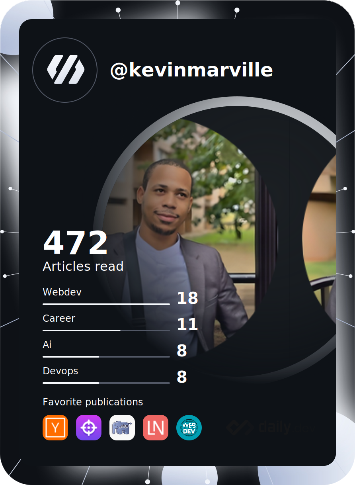

  

  

  <a href="https://kvnbbg.fr">Portfolio</a> •
  <a href="https://github.com/kvnbbg">GitHub</a> •
  <a href="https://linkedin.com/in/marvillekevin">LinkedIn</a> •
  <a href="https://techandstream.com">Techandstream</a>

  
  
  

## 👋 About

I’m **Kevin Marville**, also known as **Kvnbbg** in the open-source world, and **Techandstream** for commercial and freelance work. I design, build, and ship end-to-end digital products: reliable architectures, elegant UI/UX, and smooth cloud delivery — always with a **DRY, SMART, ready-to-ship** mindset.

**Why teams work with me**
- **Product clarity**: from idea to actionable roadmap and execution.
- **Engineering depth**: frontend, backend, mobile, DevOps, and cloud.
- **Design sensibility**: UX-first workflows, clean UI, and fast feedback loops.
- **Delivery focus**: scalable systems with production-grade polish.

## 🚀 What I build

- **Web & Mobile Apps** (React, Vue, Flutter, Kotlin, Node.js)
- **Product Platforms** (Dashboards, SaaS, marketplaces, content systems)
- **3D/Interactive Experiences** (Three.js, motion design, immersive UI)
- **Cloud Delivery** (Docker, Kubernetes, AWS, CI/CD)

## 🌟 Featured Projects

### Open Source & Community
- **[Kvnbbg GitHub](https://github.com/kvnbbg)** — templates, experiments, and dev tooling.
- **[Blog & Portfolio](https://kvnbbg.fr)** — personal showcase and technical writing.

### Commercial / Freelance (Techandstream)
- **[Techandstream](https://techandstream.com)** — product engineering, creative media, and content-driven platforms.
- **Client-focused builds** — from MVP to production releases.

## ✨ Usability & Rendering Improvements

To avoid blank sections or broken visuals on GitHub/mobile, the README now:
- Uses **lightweight, responsive cards** with fallbacks.
- Groups core info at the top for **instant visibility**.
- Includes a **self-hosted animated contact card** (below) so key info always renders.

## 📬 Matrix Contact (Freelance)

  

## 🤝 Connect

  
  
  
  

## 📊 GitHub Snapshot

  
  

  

## 🛠️ Toolbox

  
<strong>🚀 Daily Stack</strong>

  - Frontend: React, Vue, TypeScript
  - Backend: Node.js, Python, PHP
  - Mobile: Flutter, Kotlin
  - Infra: Docker, Kubernetes, AWS

  
  
  
  
  
  
  
  
  
  
  
  

## 📈 Social Proof

  
<strong>💡 Delivery Principles</strong>

  - **DRY**: reusable components, modular systems.
  - **SMART**: clear, measurable, impact-driven goals.
  - **Ready-to-ship**: stable UI, production-grade quality.

